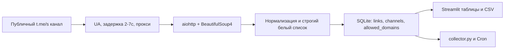

# Агрегатор ссылок Telegram / Telegram Link Aggregator

**Язык:** [Русский](#русский) | [English](#english)

## Русский

Streamlit-приложение собирает внешние ссылки из публичной веб-версии Telegram (`https://t.me/s/{channel}`), сохраняет только URL из белого списка доменов и ведет SQLite-историю с дедупликацией.

### Запуск

```powershell
python -m venv .venv
.\.venv\Scripts\Activate.ps1
Copy-Item .env.example .env
pip install -r requirements.txt
streamlit run app.py
```

Для Linux/macOS замените активацию на `source .venv/bin/activate`, а копирование файла на `cp .env.example .env`.

CLI-сборщик для ручного запуска или Cron:

```bash
python collector.py
```

При первом запуске создается `data/telegram_links.sqlite3`, добавляются каналы `machinelearning_ru`, `vc_ai`, `shir_man`, `ai_jobs`, `neural_ch`, `open_ai_news` и домены `github.com`, `huggingface.co`, `arxiv.org`, `modelscope.ai`, `gitverse.ru`.

### Белый список

Сохраняются URL с точным разрешенным доменом или его поддоменом. `docs.github.com` разрешен для `github.com`; `notgithub.com` и URL, где `github.com` встречается только в query-параметре, отклоняются. Добавляйте `habr.com` или `youtube.com` вручную через боковую панель.

### Деплой

Для UI: загрузите проект в GitHub, откройте Streamlit Cloud, выберите репозиторий и `app.py`. SQLite в Streamlit Cloud временная, поэтому для продакшена используйте постоянную БД, например Supabase/PostgreSQL.

Для ежедневного запуска на PythonAnywhere создайте задачу на 08:00:

```bash
python3 /home/username/tg_link_aggregator/collector.py
```

Логи доступны в `logs/collector.log`. При блокировке или недоступности `t.me` канал записывается как ошибка, а приложение продолжает работу.

### Архитектура



Юридическая памятка: обрабатываются только публичные данные; соблюдайте robots.txt, правила Telegram и разумную частоту запросов.

## English

The Streamlit application collects external links from the public Telegram web view (`https://t.me/s/{channel}`), stores only URLs from the domain allowlist, and keeps a deduplicated SQLite history.

### Run locally

```bash
python -m venv .venv
source .venv/bin/activate
cp .env.example .env
pip install -r requirements.txt
streamlit run app.py
```

For Windows PowerShell, use `.\.venv\Scripts\Activate.ps1` and `Copy-Item .env.example .env`.

Run the CLI collector manually or from Cron:

```bash
python collector.py
```

The first run creates `data/telegram_links.sqlite3`, adds the default channels and the `github.com`, `huggingface.co`, `arxiv.org`, `modelscope.ai`, and `gitverse.ru` allowlist domains.

### Allowlist and deployment

Exact allowed domains and their subdomains pass the filter. Add optional domains such as `habr.com` or `youtube.com` manually in the sidebar. Deploy the UI through Streamlit Cloud from GitHub. Use `python3 /home/username/tg_link_aggregator/collector.py` as an 08:00 PythonAnywhere task for daily collection.

Only public data is processed. Follow robots.txt, Telegram rules, and a reasonable request rate.
